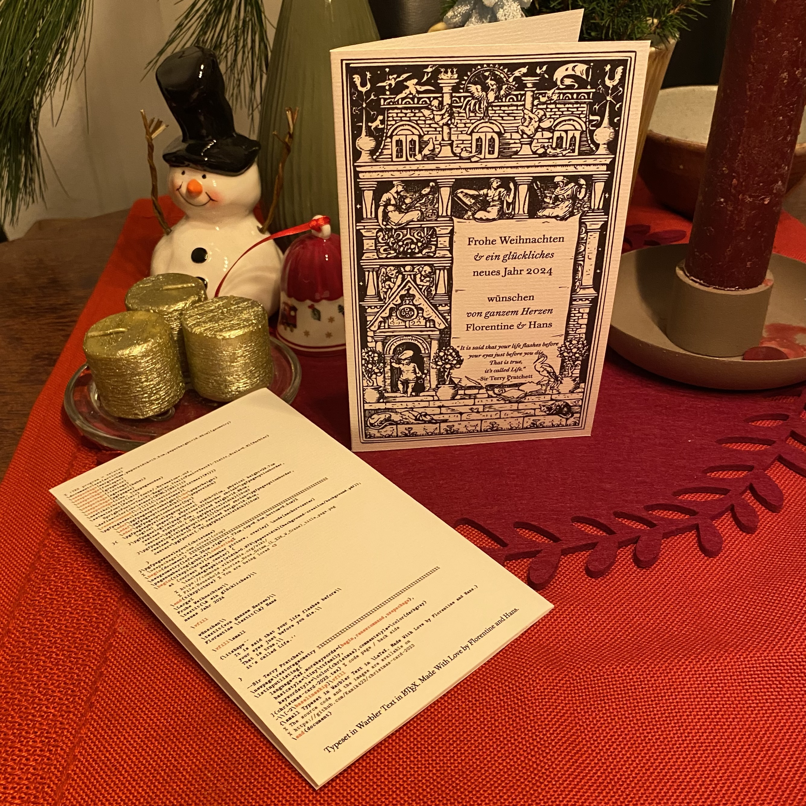
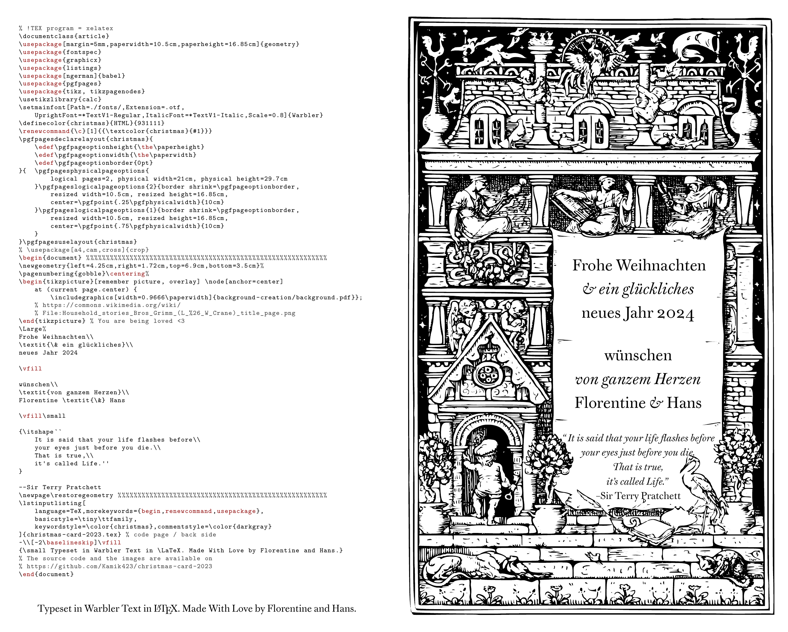

# Christmas Card 2023

Christmas card set in LaTeX with DJR’s [Warbler Text](https://djr.com/notes/warbler-text-font-of-the-month).

Based on my [2021 christmas card](https://github.com/Kamik423/christmas-card-2021) and my [2021 christmas card](https://github.com/Kamik423/christmas-card-2019).

## Background Image

Adapted from the title page of *Household stories from the collection of the Bros. Grimm* [on archive.org](https://archive.org/details/householdstories00grim/page/n7/mode/2up), no license given, presumably public domain.
Editing steps present in *background-creation/,* edited with macOS’s Preview.‍app, Acorn, Procreate, and Vectornator (now Linearity Curve).
Removed noise and text and edited out the big *H* on the left.

Originally I intended to make a stamp to print it and even got a prototype made, but eventually the time ran out to print it with my home inkjet printer.

## License

The LaTeX source and the PDF are otherwise licensed under the MIT License; feel free to modify or reuse it:

> Copyright © 2023 Hans Schülein (Kamik423)
>
> Permission is hereby granted, free of charge, to any person obtaining a copy of this software and associated documentation files (the “Software”), to deal in the Software without restriction, including without limitation the rights to use, copy, modify, merge, publish, distribute, sublicense, and/or sell copies of the Software, and to permit persons to whom the Software is furnished to do so, subject to the following conditions:
>
> The above copyright notice and this permission notice shall be included in all copies or substantial portions of the Software.
>
> THE SOFTWARE IS PROVIDED “AS IS”, WITHOUT WARRANTY OF ANY KIND, EXPRESS OR IMPLIED, INCLUDING BUT NOT LIMITED TO THE WARRANTIES OF MERCHANTABILITY, FITNESS FOR A PARTICULAR PURPOSE AND NONINFRINGEMENT. IN NO EVENT SHALL THE AUTHORS OR COPYRIGHT HOLDERS BE LIABLE FOR ANY CLAIM, DAMAGES OR OTHER LIABILITY, WHETHER IN AN ACTION OF CONTRACT, TORT OR OTHERWISE, ARISING FROM, OUT OF OR IN CONNECTION WITH THE SOFTWARE OR THE USE OR OTHER DEALINGS IN THE SOFTWARE.
